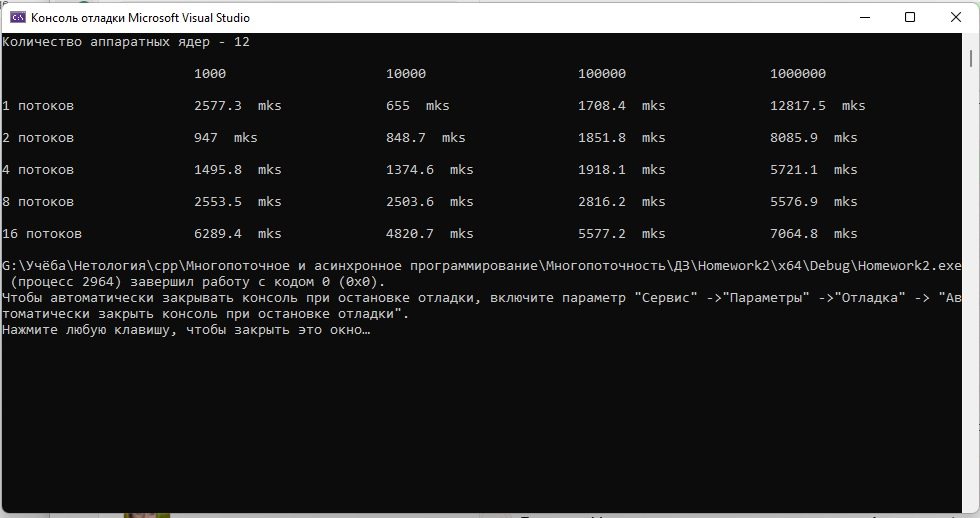

# Домашняя работа
# Многопоточность
### Задание 1
Два потока управляют переменной count, и обращаются к ней по ссылке. Переменная value задаёт количество клиентов, которые займут очередь. Перед запуском потока, имитирующего операциониста, выдержал время 500 мс. С этой паузой наблюдать за очередью удобнее.
### Задание 2
Вектора для обработки в потоках были созданы и заполнены рандомными значениями от 1 до 100 заранее. Все потоки запускаются в цикле. Время работы измеряется в микросекундах. 

Результат работы программы:
